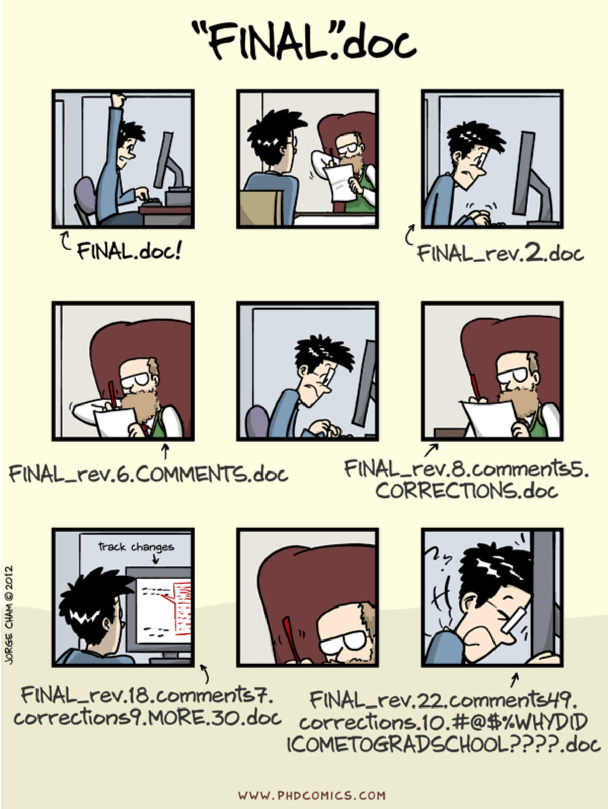

## Outline
1. What and why of version control
2. Habit formation
3. Hands-on: use Git and Github to edit a "homework assignment" and "submit it"
4. A tour through how we use Github as a course delivery system
5. Teaching Git and Github - pedagogical best practices
6. When is it appropriate to use Git and Github as a course delivery system

# What and why of version control

## What is version control?
<center></center>
<center>source: Software Carpentry Git lesson: http://swcarpentry.github.io/git-novice/</bp><p>

<center></center>


## Why of version control?
<center></center>

# Habit formation

## habits
<font size="5">

*Definition*: 

*Behaviours arising from repetitive reinforcement learning that persist after removal or devaluation of reinforcements ([Smith & Graybiel, 2016](https://www.ncbi.nlm.nih.gov/pmc/articles/PMC4826769/)).*</font> 

## Why do we care about creating version control habits?
- Version control is an expected hourly/daily task of a professional Data Scientist (and many other computational jobs)
- Takes significant cognitive effort for novices to use popular version control tools 
- Behaviours that become habits require minimal cognitive effort, freeing up cognitive resources for other tasks

## How do we create version control habits in the UBC Master of Data Science program?
<center></center>
- Teach our students to use Git and Github on day 1 of the program
- Reinforce the use of version control by:
    - making it the required method of submitting work
    - evaluating and assessing their performance in using version control (counts towards grades)
- Repitition! Over 10 months, students use version control > 300 times to:
    - access and submit labs
    - access and submit quizzes
    - work iteratively on individual projects
    - work collaboratively on group projects 
    - give and receive peer feedback
    - receive feedback from TAs and Instructors

# Hands-on:</br> use Git and Github to edit a "homework assignment" and "submit it"

## Set-up

*assuming you have a UBC cwl...*

- Sign up for an account with [Github.com](https://github.com/) (if you don't already have one)
- login to [ubc.syzygy.ca](https://ubc.syzygy.ca/) with your cwl
- Click on:
  1. "Start Server"
  2. "New" > "Terminal"
  3. enter the following (changing the values in the quotes to ones appropriate for your [Github.com](https://github.com/) account)
  ```
  git config --global user.name "ttimbers""
  git config --global user.email "tiffany.timbers@gmail.com"
  ```
  
## Activity overview

Now that we're set up to use Git, let's walk through a workflow very similar to what the students would do (and learn a little Git along the way!)

1. Get your own copy of the example homework folder (Github repository)
2. "clone"" that copy to a place you can edit the files (e.g.,[ubc.syzygy.ca](https://ubc.syzygy.ca/) or your own computer if you have already have Git installed there)
3. Edit and save the changes to the files
4. Use Git to log the changes ("add" and "commit")
5. Send the logged Git changes to Github ("push") to submit the work

## 1. Get your own copy

Go to the URL below and click on the "Fork" button (top right-hand corner)

www.URL.com

## 2. "clone"" that copy to a place you can edit the files

- Click on the "Clone or download" (green button) of the new website you were directed to. Copy the URL that pops up.

- Go back to the "Terminal" on [ubc.syzygy.ca](https://ubc.syzygy.ca/) and type the following (replace URL with the URL you just copied):
  ```
  git clone URL
  ```
- using "TERMINAL" navigate into that directory by typing NAME_OF_REPO

## 3. Edit and save the changes to the files

- Click on the "Home" [ubc.syzygy.ca](https://ubc.syzygy.ca/) tab in your browser and use the file navigator to find THIS_FILE in the NAME_OF_REPO directory/folder
- Follow the instructions to answer the homework questions
- Save the changes (File -> Save)

## 4. Use Git to log the changes 

- Go back to the "Terminal" on [ubc.syzygy.ca](https://ubc.syzygy.ca/) 
- Ask Git what files were changed by typing: `git status`
- log those changes to git by typing the following two lines into terminal:
  ```
  git add THIS_FILE
  git commit -m "first attempt at homework questions"
  ```

## 5. Send the logged Git changes to Github ("push") to submit the work

- In the "Terminal" on [ubc.syzygy.ca](https://ubc.syzygy.ca/) type (*note - you will be asked to enter your Github username and password here*):
  ```
  git push
  ```
- Go back to your copy of the homework on [Github.com](https://github.com/) and check to see that you were successful in submitting this homework.

## Reflect on workflow
- its not easy!
- but its an essential skill for those who use computation!

# A tour through how we use Github as a course delivery system

[https://github.ubc.ca/ubc-mds-2017](https://github.ubc.ca/ubc-mds-2017)

*note - most of you will not have access to the link above*

# Teaching Git and Github - pedagogical best practices
(alternate slide title: Lessons learned...)

- go slowly and have the students practice many repetitions
- use a motivating example (e.g., homework, updating a blog/website)
- start by introducing version control using the Github website first 
- use the command line to teach students to use git (as opposed to the GUI's out there)
- teach on a need to know basis, for example with Git teach the simpler and less verbose versions of the commands
- teach best practices of version control along with the version control tools
- introduce more advanced Git and Github features over time (log, checkout, issues, pull requests, branching, etc)

# When is it appropriate to use Git and Github as a course delivery system

## When is it appropriate to use Git and Github as a course delivery system

- Students have some computing background, and/or...

- Students have motivation/need to use version control beyond your single course